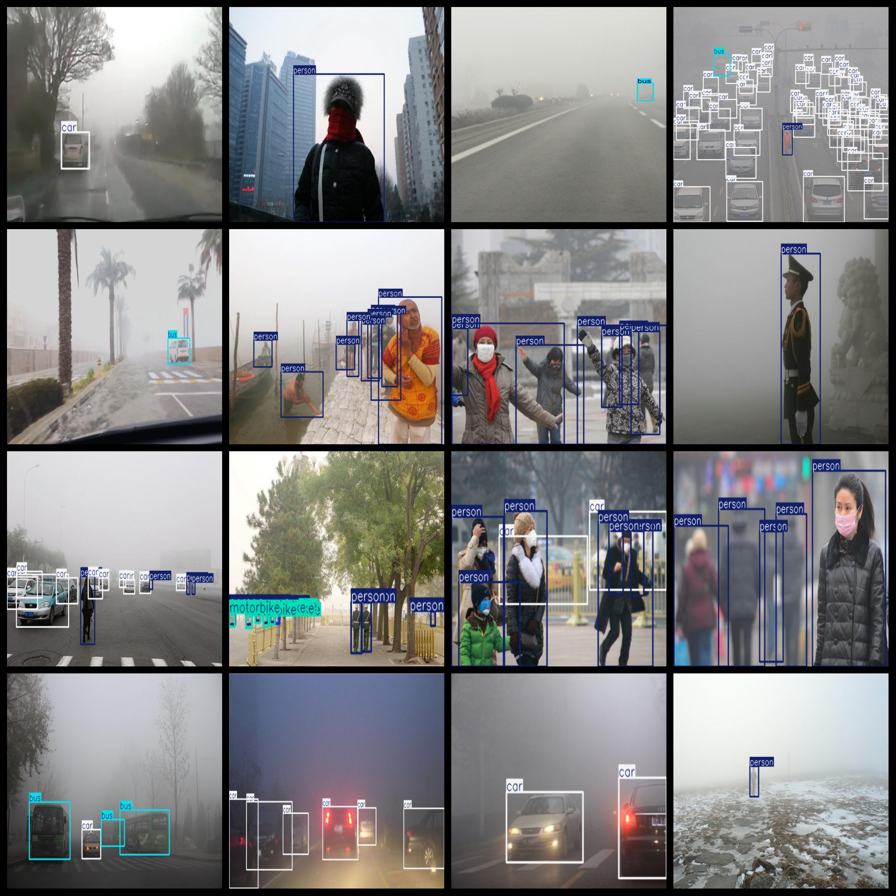
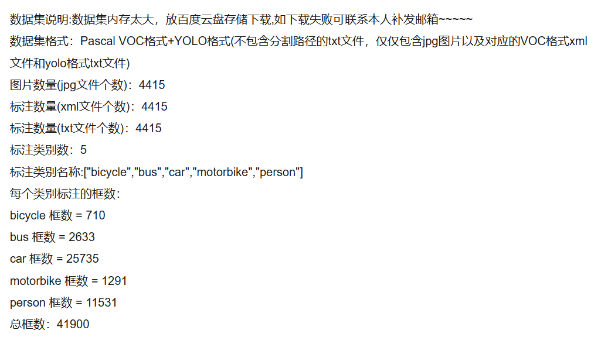

# [Object Detection] Foggy Driving Person Vehicle Detection Dataset VOC+YOLO format4415 images5-class

Dataset Description: ~

Dataset format: Pascal VOC format + YOLO format (the txt file does not contain the split path, it only contains jpg images and corresponding VOC format xml files and yolo format txt files)

Number of images (number of jpg files): 4415

Number of annotations (number of xml files): 4415

Number of annotations (number of txt files): 4415

Number of callout categories: 5

Annotation class names: ["bicycle","bus","car","motorbike","person"]

Number of boxes labeled in each category:

bicycle frame count = 710

bus frame count = 2633

car frame count = 25735

motorbike frame count = 1291

person frame count = 11531

Total boxes: 41900

Annotation examples or image overview:

## Images

---

Here is a pay link on Stripe (https://buy.stripe.com/3cs8yP7sY87d0vu9AB). Please contact me lonlonago@foxmail.com after funding $89, and I will send you a complete data files, thank you!

